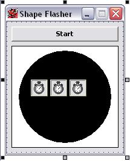

## Shape Flasher Update

### Description

The purpose of this program is when the Start button is pressed the shape (Circle) flashes on and off in a very effective way. I have been programming for 2 months now ... Please check out my code & Please Vote for me :)
 
### More Info
 

             |
---                |---
**Submitted On**   |2002-11-15 12:52:22
**By**             |[Robbie  Carter](https://github.com/Planet-Source-Code/PSCIndex/blob/master/ByAuthor/robbie-carter.md)
**Level**          |Intermediate
**User Rating**    |3.7 (22 globes from 6 users)
**Compatibility**  |VB 6\.0
**Category**       |[Graphics](https://github.com/Planet-Source-Code/PSCIndex/blob/master/ByCategory/graphics__1-46.md)
**World**          |[Visual Basic](https://github.com/Planet-Source-Code/PSCIndex/blob/master/ByWorld/visual-basic.md)
**Archive File**   |[Shape\_Flas14982011162002\.zip](https://github.com/Planet-Source-Code/robbie-carter-shape-flasher-update__1-40758/archive/master.zip)

